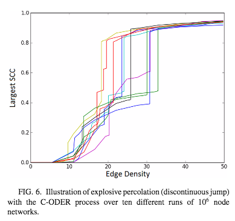

# Modeling explosive directed percolation

Waagen, A., D’Souza, R. M., & Lu, T.-C. (2017). Explosive percolation on directed networks due to monotonic flow of activity. Physical Review E, 96(1). https://doi.org/10.1103/physreve.96.012317

From the overview:
> ... here we introduce two percolation models on a set of rank-ordered nodes where edges are added monotonically with respect to the rank ordering...

They claim this is analogous to networks such as Twitter followings/responses to the Higgs-Boson discovery.

## Outline:
- Introduction
  - What is percolation?
  - What is directed versus undirected percolation?
  - What is rank ordering, in the context of percolation?
  - What is the state of the art here?
  - What is the Erdos-Renyi model of percolation, and why might you want to change that?
- Question/what I set out to do
  - Replicate two percolation model implementations
    - MAYBE: Compare to behavior in the tweets they show
  - Also try a middle-of-the-road percolation model of my own
  - Demonstrate a discontinuity in its clustering behavior
- Relevant science:
  - Finding the critical point in a different types of percolation
  - Studying the critical phenomena of percolation models
- Relevant computational methods:
  - Had to seriously upgrade my clustering methods: HK > Newman-Ziff > what they implement in this paper
  - "Methods of scaling and critical phenomena for studying the phase transition for percolation"
- Methods
  - ODER and C-ODER percolation models
  - Clustering algorithm: different from Newman-Ziff
- Results
  - TBD

## Introduction
### Network sciecne background
- Erdos-Renyi graphs (random, non-directed graphs): [link here](https://en.wikipedia.org/wiki/Erd%C5%91s%E2%80%93R%C3%A9nyi_model)
- Directed Erdos-Renyi graphs, DER (directed edges)
- Paper covers two models:
  - Ordered, directed Erdos-Renyis (ODER)
  - Competitive ODER

### Model 1: Ordered, Directed Erdos-Renyi (ODER)
- Generalization of the directed ER model to ordered graph
- Form two large components, which explosively merge (discontinuous jump in the size of the largest strongly connected component)

### Model 2: Competitive ODER
- Adds competition: preference for connecting nodes of similar rank
- See similar discontinuous jump in cluster size, but "more explosive"
- Get an effective phase separation of the two large components: one containing the lower-ranked users, one containing the higher-ranked users
- TAKEAWAY: Some bias towards grouping similar-ranked nodes leads to formation of two distinct groups of nodes (classes) with little flow of information between the classes

## Methods
### What I will actually do for this project
1. Implement ODER and C-ODER algorithms
    - Not trivial but not terrible (Section III A and B; kinda monte-carlo esque?)
    - Other cool ideas to expand upon this...
      - Could you extrapolate between directed and undirected by applying a monte-carlo like acceptance criteria to ODER? interesting...
      - What if, instead of rank, you would only link to nodes that had a value close to you, and play with that tolerance?
      - What it, on top of that, you had some nodes that would act as "influencers"?
2. Replicate finding that the cluster size transition is discontinuous (Section IVA)
    - They use that the jump happens with the addition of one edge length to say that it's discontinuous (See II.A for more)
    - SCC is the "strongly connected component"   
2. Find the critical exponents..? i.e. can I replicate their results?
<!-- 3. Investigate the rank-separation phenomena in the C-ODER process -->

### Potential hiccups:
- **Vizualization**: Not intuitive how to visualize these networks easily-- will need to explore tools used in this field
- __Clustering algorithm__: The clustering method they implement is $O(E\log{E})$, where $E$ is the number of edges at a given snapshot. I will have to implement this from scratch.

### Packages I will use:
- Pandas, numpy, scipy
- [Pypercolate](http://pypercolate.readthedocs.io/en/stable/pypercolate.html): Python implementation of Newman-Ziff algorithm
  - However, N-Z does not work for directed networks; I will need to adapt this based on the algorithm presented in the paper

## Personal reference
### Learning, next steps:
- [ ] Do these practice exercises:
  - [ ] [Introduction to networks](http://pages.physics.cornell.edu/~myers/teaching/ComputationalMethods/ComputerExercises/Networks/NetworksExercise.html)
  - [ ] [Percolation](http://pages.physics.cornell.edu/~myers/teaching/ComputationalMethods/ComputerExercises/Percolation/Percolation.html)
- [ ] Read:
  - [ ] Papers from Ziff on directed and explosive percolation
  - [ ] Networks: an introduction (M.E.J. Newman)
  - [ ] Introduction to Percolation (see email Ziff)

### Coding, next steps:
- [ ] Mock up ODER and C-ODER simulations
- [ ] Develop clustering algorith,=m
- [ ] Determine how to visualize percolation networks
- [ ] *TBD*
